# Introduccion

Kali se introdujo por primera vez en 2012 con una arquitectura completamente nueva. Esta distribución basada en Debian se lanzó con más de 300 herramientas especializadas para pruebas de penetración y análisis forense digital. Lo mantiene y financia Offensive Security Ltd y los desarrolladores principales son Mati Aharoni, Devon Kearns y Raphael Hertzog.

Kali 2.0 entró en escena en 2016 con toneladas de nuevas actualizaciones y nuevos entornos de escritorio como las compilaciones KDE, Mate, LXDE, e17 y Xfce.

Si bien Kali ya está equipado con cientos de increíbles herramientas y utilidades para ayudar a los evaluadores de penetración de todo el mundo a realizar su trabajo de manera eficiente, en este capítulo cubriremos principalmente algunos ajustes personalizados que se pueden utilizar para tener una experiencia de pentesting aún mejor para los usuarios.
### Configuring Kali Linux

Usaremos la ISO oficial de Kali Linux proporcionada por Offensive Security para instalar y configurar diferentes entornos de escritorio como los escritorios Mate, e17, Xfce, LXDE y KDE.

Preparándose Para comenzar con esta receta usaremos la ISO de Kali Linux de 64 bits que figura en el sitio web de Offensive Security: https://www.kali.org/downloads/
Para usuarios que buscan configurar Kali en una máquina virtual como VMware, VirtualBox, etc., se puede descargar una imagen prediseñadas de Linux desde https://www.offensive-security.com/kali-linux-vmware-virtual box-image-download/.
Usaremos la imagen virtual en este capítulo y la personalizaremos con algunas herramientas adicionales.
### Cómo hacerlo...
Algunas de las herramientas se enumeran en las siguientes secciones.
### DNSCAN
Dnscan es una herramienta de Python que utiliza una lista de palabras para resolver subdominios válidos. Para obtener más información sobre Dnscan, siga los pasos indicados:
1. Usaremos un comando simple para clonar el repositorio de git:
	`git clone https://github.com/rbsec/dnscan.git`
La siguiente captura de pantalla muestra el comando anterior:

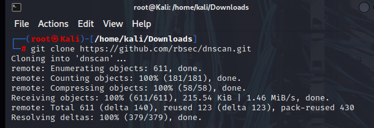

1. También puedes descargarlo y guardarlo desde https://github.com/rbsec/dnscan.
2. A continuación navegamos hasta el directorio donde descargamos Dnscan.
3. Ejecute Dnscan usando el siguiente comando: `./dnscan.py -h`
La siguiente captura de pantalla muestra el resultado del comando anterior:

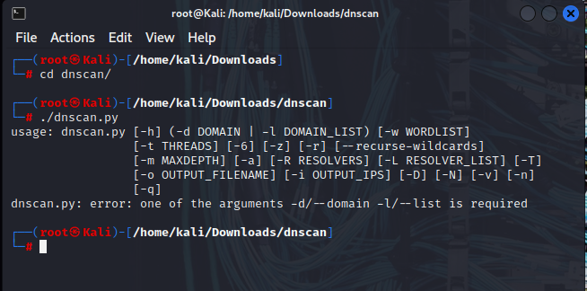
### subbrute
A continuación instalaremos subbrute. Es sorprendentemente rápido y proporciona una capa adicional de anonimato, ya que utiliza solucionadores públicos para forzar los subdominios con fuerza bruta:
1. El comando aquí es nuevamente simple: 
	`git clone https://github.com/TheRook/subbrute.git`
La siguiente captura de pantalla muestra el comando anterior:

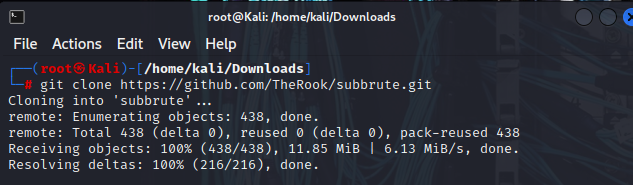

1. O puedes descargarlo y guardarlo desde https://github.com/TheRook/subbrute.
2. Una vez que se complete la instalación, necesitaremos una lista de palabras para ejecutarla y podremos descargar la lista de dnspop. Esta lista también se puede utilizar en la receta anterior: https://github.com/bitquark/dnspop/tree/master/results.
3. Una vez que ambos estén configurados, navegamos hasta el directorio del subbrute y lo ejecutamos usando el siguiente comando: `./subbruto.py`
4. Para ejecutarlo en un dominio con nuestra lista de palabras usamos el siguiente comando:
`./subbrute.py -s /ruta/a/lista de palabras nombrehost.com`
### Dirsearch
Nuestra siguiente herramienta en la línea es dirsearch. Como sugiere el nombre, es una herramienta de línea de comandos simple que se puede utilizar para forzar directorios con fuerza bruta. Es mucho más rápido que el DIRB tradicional:
1. El comando para instalar es: `git clone https://github.com/maurosoria/dirsearch.git`
2. O puede descargarlo y guardarlo desde https://github.com/maurosoria/dirsearch. 

La siguiente captura de pantalla muestra el comando anterior:

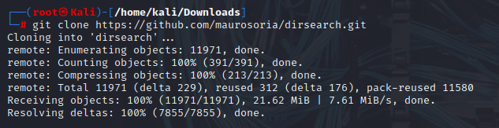

1.     Once the cloning is complete browse to the directory and run the tool by using the      following:
`./dirsearch.py -u hostname.com -e aspx.php`

The following screenshot shows the output for the preceding command:

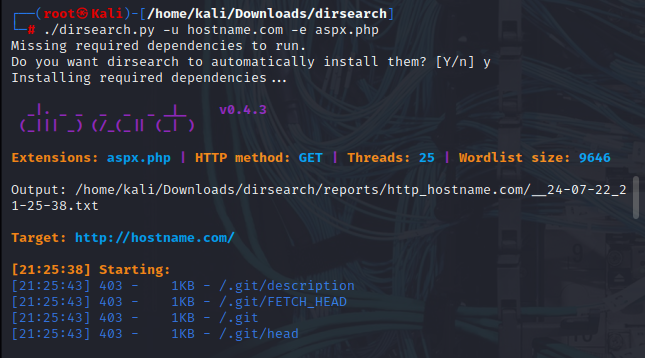
### Pentesting  VPN's ike-scan

A menudo, durante un pentest podemos encontrar puntos finales de VPN. Sin embargo, encontrar vulnerabilidades en esos puntos finales y explotarlas no es un método muy conocido. Los puntos finales de VPN utilizan el protocolo Internet Key Exchange (IKE) para configurar una asociación de seguridad entre varios clientes para establecer un túnel VPN.
IKE tiene dos fases, la fase 1 es responsable de configurar y establecer un canal de comunicación autenticado seguro y la fase 2 cifra y transporta datos.
Nuestro foco de interés aquí sería la fase 1; Utiliza dos métodos para intercambiar claves:
## Modos Principales
### Modo agresivo
Buscaremos puntos finales VPN habilitados en modo agresivo utilizando la autenticación PSK.
### Preparándose
Para esta receta usaremos las herramientas ike-scan e ikeprobe. Primero instalamos ike-scan clonando el repositorio de git: `git clone https://github.com/royhills/ike-scan.git`
O puede utilizar la siguiente URL para descargarlo desde https://github.com/royhills/ike-scan.
### Cómo hacerlo...
Para configurar ike-scan siga los pasos indicados:
1. Busque el directorio donde está instalado ike-scan.
2. Instale autoconf ejecutando el siguiente comando: `apt-get install autoconf`
3. Ejecute` autoreconf --install` para generar un archivo .configure.
4. Ejecute `./configure`.
5. Ejecute `make` para construir el proyecto.
6. Ejecute `make check` para verificar la etapa de construcción.
7. Ejecute `make install` para instalar ike-scan.
8. Para escanear un host en busca de un protocolo de enlace en modo agresivo, utilice los siguientes comandos:  `ike-scan x.x.x.x -M -A`
La siguiente captura de pantalla muestra el resultado del comando anterior:

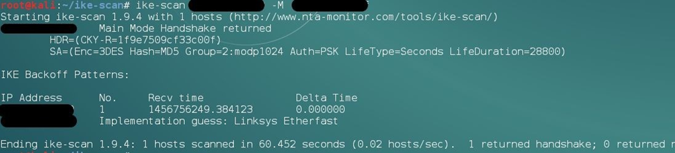

1. A veces veremos la respuesta después de proporcionar un nombre de grupo válido como (vpn): `ike-scan x.x.x.x -M -A id=vpn`

Incluso podemos forzar los nombres de los grupos usando el siguiente script:
 https://github.com/SpiderLabs/groupenum.
El comando: `./dt_group_enum.sh x.x.x.x nombres de grupo.dic`
### Rompiendo el PSK
Para aprender cómo descifrar el PSK, siga los pasos indicados:
1. Al agregar un indicador `-P` en el comando `ike-scan`, se mostrará una respuesta con el hash capturado.
2. Para guardar el hash, proporcionamos un nombre de archivo junto con el indicador `-P`.
3. A continuación podemos usar `psk-crack` con el siguiente comando: `psk-crack -b 5 /path/to/pskkey`
4. Donde `-b` es el modo de fuerza bruta y la longitud es 5.
5. Para usar un ataque basado en diccionario usamos el siguiente comando: `psk-crack -d /path/to/dictionary /path/to/pskkey`
La siguiente captura de pantalla muestra el resultado del comando anterior:

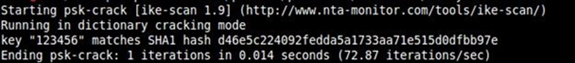
### Cómo funciona...
En modo agresivo, el hash de autenticación se transmite como respuesta al paquete del cliente VPN que intenta establecer un túnel de conexión (IPSEC). Este hash no está cifrado y por lo tanto nos permite capturar el hash y realizar un ataque de fuerza bruta contra él para recuperar nuestro PSK.
Esto no es posible en el modo principal ya que utiliza un hash cifrado junto con un protocolo de enlace de seis vías, mientras que el modo agresivo utiliza sólo tres vías.
### Configurar cadenas proxy
A veces necesitamos permanecer imposibles de rastrear mientras realizamos una actividad de pentest. Proxychains nos ayuda permitiéndonos utilizar un sistema intermediario cuya IP puede dejarse en los registros del sistema sin la preocupación de que llegue hasta nosotros.
Proxychains es una herramienta que permite que cualquier aplicación siga una conexión a través de un proxy como SOCKS5, Tor, etc.
### Cómo hacerlo...
Proxychains ya está instalado en Kali. Sin embargo, necesitamos una lista de servidores proxy en su archivo de configuración que queremos usar:
1. Para ello abrimos el archivo de configuración de proxychains en un editor de texto con este comando:
		`leafpad	/etc/proxychains.conf`
La siguiente captura de pantalla muestra el resultado del comando anterior:

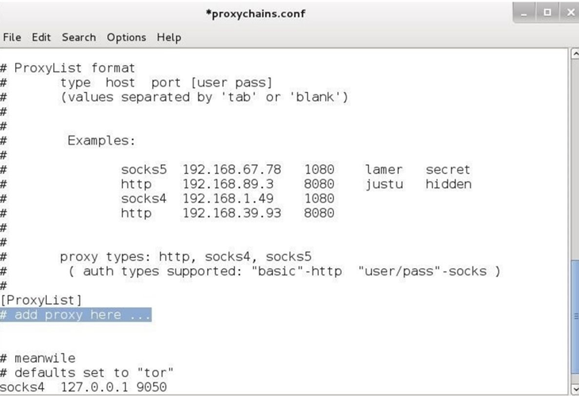

Podemos agregar todos los proxies que queramos en el área resaltada anterior y luego guardar.
Proxychains también nos permite usar cadena dinámica o cadena aleatoria mientras nos conectamos a servidores proxy.
1. En el archivo de configuración, descomente dynamic_chain or random_chain:

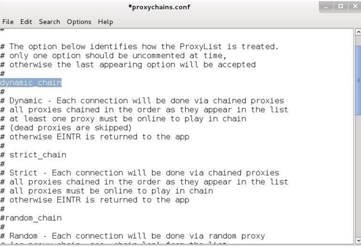
### Usando cadenas proxy con tor
Para obtener más información sobre Tor, siga los pasos indicados:
1. Para usar proxychains con tor, primero necesitamos instalar tor usando el siguiente comando:
	  `apt-get install tor`
1. Una vez instalado, ejecutamos tor escribiendo tor en la Terminal.
2. Luego abrimos otra Terminal y escribimos el siguiente comando para usar una aplicación a través de proxychains: 
		`proxychains toolname -arguments`
La siguiente captura de pantalla muestra el ejemplo de los comandos anteriores:

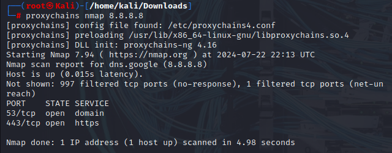
### Saliendo de caza con Routerhunter
Routerhunter es una herramienta que se utiliza para encontrar enrutadores vulnerables en una red y realizar varios ataques para explotar la vulnerabilidad DNSChanger. Esta vulnerabilidad permite a un atacante cambiar el servidor DNS del enrutador y así dirigir todo el tráfico a los sitios web deseados.
### Preparándose
Para esta receta, nuevamente necesitarás clonar un repositorio de git.
Usaremos el siguiente comando:
 `clon de git https://github.com/jh00nbr/RouterHunterBR.git`
### Cómo hacerlo...
Para ejecutar `RouterHunterBR.php` siga los pasos indicados:
1. Una vez clonado el archivo, ingrese al directorio.
2. Ejecute el siguiente comando:
	  `php RouterHunterBR.php -h`
La siguiente captura de pantalla muestra el resultado del comando anterior:

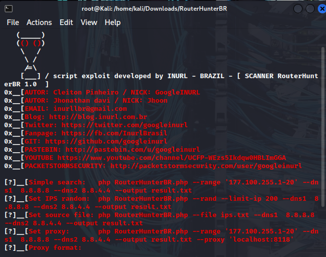

3. Podemos proporcionarle a Routerhunter un rango de IP, IP del servidor DNS, etc.
