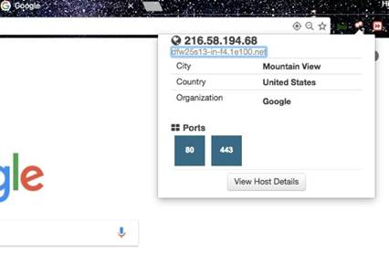

# Recopilación de información y planificación de estrategias de ataque

### Introducción
Aprendimos en el capítulo anterior los conceptos básicos de la caza de subdominios. En este capítulo, profundizamos un poco más y analizamos otras herramientas diferentes disponibles para reunir Intel en nuestro objetivo. Comenzamos usando las infames herramientas de Kali Linux.
La recopilación de información es una etapa muy crucial en la realización de una prueba de penetración, ya que cada paso siguiente que demos después será totalmente el resultado de toda la información que recopilemos durante esta etapa. Por eso es muy importante que recopilemos la mayor cantidad de información posible antes de pasar a la etapa de explotación.
### Obtener una lista de subdominios
No siempre tenemos una situación en la que un cliente ha definido un alcance completo y detallado de lo que necesita ser probado. Por lo tanto, utilizaremos las recetas mencionadas a continuación para recopilar tanta información como podamos para realizar un pentest.
### Fierce
Comenzamos con saltando a la Terminal de Kali y usando la primera y la más herramienta ampliamente utilizada feroz.
### Cómo hacerlo...

Los siguientes pasos demuestran el uso de fierce:

1.     Para  iniciar fierce,  escribimos  fierce -h  para  ver el menú de ayuda:

1. Para realizar un escaneo de subdominio usamos el siguiente comando:
	`fierce --domain host.com --connect`
La siguiente captura de pantalla muestra el resultado del comando anterior:

### DNSdumpster
Este es un proyecto gratuito de Hacker Target para buscar subdominios. Se basa en https://scans.io/ para sus resultados. También se puede utilizar para obtener los subdominios de un sitio web. Siempre deberíamos preferir usar más de una herramienta para la enumeración de subdominios, ya que podemos obtener algo de otras herramientas que la primera no pudo seleccionar.
### Cómo hacerlo...
Es bastante sencillo de utilizar. Escribimos el nombre de dominio para el que queremos los subdominios y nos mostrará los resultados.

### Usar Shodan para divertirse y obtener ganancias
Shodan es el primer motor de búsqueda del mundo que busca dispositivos conectados a Internet. Fue lanzado en 2009 por John Matherly. Shodan se puede utilizar para buscar cámaras web, bases de datos, sistemas industriales, videojuegos, etc. Shodan recopila principalmente datos sobre los servicios web más populares en ejecución, como HTTP, HTTPS, MongoDB, FTP y muchos más.
### Preparándose
Para utilizar Shodan necesitaremos crear una cuenta en Shodan.
### Cómo hacerlo...
Para obtener más información sobre Shodan, siga los pasos indicados:
1. Abra su navegador y visite https://www.shodan.io:

2.     Comenzamos realizando una búsqueda simple de los servicios FTP en ejecución.Para hacer esto     nosotros podemos  usar los siguientes  Shodan  dorks: puerto:"21".La siguiente captura de pantalla muestra los resultados de  la búsqueda:

3.     Esta búsqueda puede hacerse más específica especificando un país/organización en particular:   puerto:"21" país:"IN".La  siguiente      captura de pantalla  muestra los    resultados de la búsqueda:

3.     Ahora podemos     ver todos los servidores FTP ejecutándose en la India; también podemos ver los servidores que permiten el inicio de sesión anónimo y la versión del servidor FTP que están ejecutando.

4.     A continuación,  probamos  el filtro de organización. Se puede hacer escribiendo puerto:"21" país:"IN" org:"BSNL" como se muestra en la siguiente captura de pantalla:

_Shodan tiene otras etiquetas también que pueden usarse para   realizar búsquedas avanzadas,  tales   como:_
_**net**:  para escanear IP rangos_ 
_**ciudad**:    para filtrar  por ciudad_

_Más    detalles pueden encontrarse en_  [_https://www.shodan.io/explore_](https://www.shodan.io/explore)

# Shodan  HoneyScore
Shodan Honeyscore es otro gran proyecto integrado en Python. Nos ayuda a determinar si una dirección IP que tenemos es un honeypot o un sistema real.

**Cómo hacerlo...**
Los siguientes pasos demuestran el uso de Shodan Honeyscore:

1.     Para   utilizar Shodan Honeyscore visitamos    [https://honeyscore.shodan.io/](https://honeyscore.shodan.io/):

2.     Introduce  la  dirección IP que queremos comprobar y ¡listo!

# Shodan  plugins

Para hacernos la vida aún más fácil, Shodan tiene complementos para Chrome y Firefox que se pueden usar para comprobar los puertos abiertos de los sitios web que visitamos mientras viajamos.

**Cómo hacerlo...**
Descargamos e instalamos el complemento desde   [https://www.shodan.io/](https://www.shodan.io/). Navega por cualquier sitio web y veremos que al hacer clic en el complemento podemos ver los puertos abiertos:

### Usando Nmap para encontrar puertos abiertos
Network Mapper (Nmap) es un escáner de seguridad escrito por Gordon Lyon. Se utiliza para encontrar hosts y servicios en una red. Salió por primera vez en septiembre de 1997. Nmap tiene varias funciones, así como scripts para realizar diversas pruebas, como encontrar el sistema operativo, la versión del servicio, inicios de sesión predeterminados de fuerza bruta, etc.
Algunos de los tipos de exploración más comunes son:
- Escaneo de conexión TCP ()
- Escaneo sigiloso SYN
- escaneo UDP
- escaneo de ping
- Escaneo inactivo
### How  to  do it...

The     following  is the recipe for using  Nmap:

1.     Nmap is already installed  in Kali Linux. We can type the  following command to start   it          and     see      all        the      options  available:  `nmap -h`

The following      screenshot   shows  the  output  of the   preceding     command:

2.     Para realizar un escaneo básico utilizamos el siguiente comando:  `nmap -sV -Pn x.x.x.x`
La siguiente captura de pantalla muestra el resultado del comando anterior:

3.     `-Pn`   implica que no comprobamos si el host está activo o no realizando primero una solicitud de ping. El parámetro `-sV` es para enumerar todos los servicios en ejecución en los puertos abiertos encontrados.

4.     Otro indicador que podemos usar es `-A`, que realiza automáticamente la detección del sistema operativo, la detección de versiones, el escaneo de secuencias de comandos y el traceroute. El comando es: `nmap -A -Pn x.x.x.x`

5.     Para escanear un rango de IP o varias IP, podemos usar este comando: `nmap -A -Pn x.x.x.0/24`
### Usando scripts
El  **Nmap Scripting Engine**   (**NSE**) permite  a los  usuarios  crear sus propios scripts   para realizar   diferentes   tareas   automáticamente. Estos scripts se ejecutan uno al lado del otro cuando se ejecuta un escaneo. Se pueden utilizar para realizar una detección de versiones más efectiva, explotar la vulnerabilidad, etc. El     comando    para usar  un script es: `nmap -Pn -sV host.com --script dns-brute`

El resultado del comando anterior es el siguiente:

Aquí, el script dns-brute intenta recuperar los subdominios disponibles mediante fuerza bruta contra un conjunto de nombres de subdominios comunes.

### Bypassing   firewalls with  Nmap
La mayoría de las veces durante un pentest nos encontraremos con sistemas protegidos por firewalls o por **Sistemas de Detección de Intrusos** (**IDS**). Nmap proporciona diferentes formas de evitar estos IDS/firewalls para realizar escaneos de puertos en una red. En esta receta, aprenderemos algunas de las formas en que podemos evitar los cortafuegos.

### TCP    ACK   scan
El escaneo ACK (-sA) envía paquetes de confirmación en lugar de paquetes SYN, y el firewall no crea registros de paquetes ACK, ya que tratará los paquetes ACK como respuestas a paquetes SYN. Se utiliza principalmente para mapear el tipo de firewall que se utiliza.
### Cómo hacerlo...
El escaneo ACK se realizó para mostrar puertos filtrados y sin filtrar en lugar de los abiertos.

El comando para escanear ACK es: `nmap -sA x.x.x.x`

Veamos la comparación de en qué se diferencia un escaneo normal de un escaneo ACK:

Aquí vemos la diferencia entre un escaneo normal y un escaneo ACK:

### Cómo funciona...
Los resultados del análisis de los puertos filtrados y sin filtrar dependen de si el firewall utilizado tiene o no estado. Un cortafuegos con estado comprueba si un paquete ACK entrante forma parte de una conexión existente o no. Lo bloquea si los paquetes no forman parte de ninguna conexión solicitada. Por lo tanto, el puerto aparecerá como filtrado durante un escaneo.

Mientras que, en el caso de un firewall sin estado, no bloqueará los paquetes ACK y los puertos aparecerán sin filtrar.

### TCP    Window scan
El escaneo de ventana    (-sW)    es casi igual  que  un escaneo  ACK excepto   que muestra puertos abiertos y cerrados.
### Cómo hacerlo...
Veamos la diferencia entre un escaneo normal y un escaneo TCP:

1.     El comando a ejecutar es: `nmap -sW  x.x.x.x`
2.     Veamos  la comparación de  en qué   un escaneo  normal difiere de un escaneo de Windows TCP:

3.     Podemos ver  la diferencia entre los      dos escaneos  en la  siguiente captura de pantalla:

### Idle    scan
El escaneo inactivo es una técnica avanzada en la que ningún paquete enviado al objetivo puede rastrearse hasta la máquina atacante. Requiere que se especifique un host zombi.